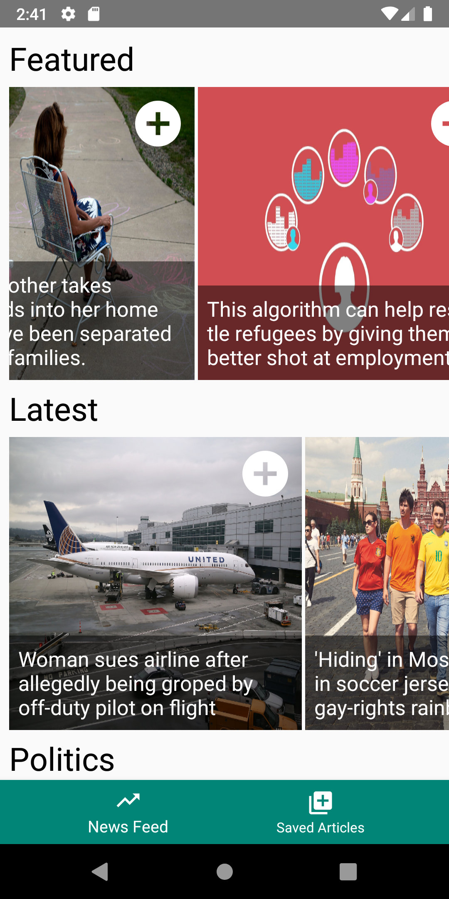

## NBC Coding Challenge
A simple application to display the news.
- A single scrolling news feed displaying featured content first, then regular text articles, then videos.
- Content grouped together by category/topic, e.g. "Politics", "Special Reports".
- Tap on any item to view the full article in your browser.
- Save articles on your news feed and view them later on the "Saved Articles" tab.
- Unsave articles in the "Saved Articles" tab.

### Testing
This application targets Android Pie (9.0 / API 28), and was manually tested on the following emulators running 9.0:
- Pixel 3
- Pixel
- Nexus 5x
- Nexus 5

### Preview

 
